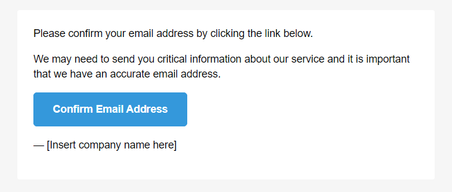

<h1 align="center">
  <br>
  <a href="https://github.com/litenova/MailBody.Core">
    
  </a>
  <br>
  MailBody.Core
  <br>
</h1>

<h4 align="center">This is a complete and simplified rewrite of <a href="https://github.com/doxakis/MailBody">MailBody</a> in .NET 6</h4>
<p align="center">Generate transactional emails such as forget password, order completed, etc.</p>

<p align="center">
  <a href="https://github.com/litenova/MailBody.Core/actions/workflows/dotnet-core.yml">
    
  </a>
  <a href="https://www.nuget.org/packages/MailBody.Core">
    
  </a>
</p>

<p align="center">
  <a href="#installation">Installation</a> •
  <a href="#how-to-use">How To Use</a> •
  <a href="#how-to-use">Showcases</a> •
  <a href="#extensibility">Extensibility</a>
</p>

## Installation

Install with NuGet:

```
dotnet add package MailBody.Core
```

## How to Use

Use the `MailBodyBuilder` class to generate your email.

```c#
var html = new MailBodyBuilder()
           .WithDefaultLayout()
           .WithParagraph("Please confirm your email address by clicking the link below.")
           .WithParagraph("We may need to send you critical information about our service and it is important that we have an accurate email address.")
           .WithButton("https://example.com/", "Confirm Email Address")
           .WithParagraph("— [Insert company name here]")
           .ToHtml();
```

Use the `MailBlockBuilder` class to generate HTML. This can be useful for nested content scenarios; for example, you need to place an image inside an `a` tag.

```c#
var image = new MailBlockBuilder()
    .WithImage("sample.png", "sample")
    .ToHtml();

var html = new MailBodyBuilder()
           .WithDefaultLayout()
           .WithParagraph("Please click on the image to download your item.")
           .WithLink(image, "www.example.com/download");
           
// or

var html = new MailBodyBuilder()
           .WithDefaultLayout()
           .WithParagraph("Please click on the image to download your item.")
           .WithLink(builder => builder.WithImage("sample.png", "sample"), "www.example.com/download");           
```

## Showcases

The picture below is a example of generated email using default layout.



## Extensibility

### Custom Elements
You can add your element by implementing `IMailElement` and passing it to the builder using `WithElement()` method. The example below demonstrates how to add the horizontal element.
```c#
// Implement the IMailElement
public class HorizontalLineElement : IMailElement
{
    public string ToHtml()
    {
        return "<hr>";
    }
}

// Pass your element to the builder
var html = new MailBodyBuilder()
           .WithParagraph("Below there is a horizontal line.")
           .WithElement(new HorizontalLineElement())
           .ToHtml();
```

### Custom Layout

You can add your custom layout by implementing `IMailLayout` and passing it to the builder using `WithLayout()` method.

```c#
// Implement the IMailElement
public class CustomLayout : IMailLayout
{
    public string ToHtml(string content)
    {
        return $@"<!DOCTYPE html>
        <html>
            <head>
                <title>Custom Layout</title>
            </head>
            
            <body>
            
                {content}
            
            </body>
        </html>"
    }
}

// Pass your layout to the builder
var html = new MailBodyBuilder()
           .WithLayout(new CustomLayout())
           .WithParagraph("Below there is a horizontal line.")
           .ToHtml();
```